    

<!-- Banner personalizado aqui -->

# 🍥 Hello, I'm Kevyn Herbert!

### Software Development Assistant with experience in web applications, automation, and containerized environments.

[🇧🇷 Português](README.md) | [🇺🇸 English](README.en.md)

 

## About me

I'm a **Software Development Assistant** working with web system maintenance and customization, automation, and containerized environment management.

In my day-to-day work, I primarily use **JavaScript, Python, PHP, MongoDB, Docker Compose, and Ubuntu servers**. I also have experience with **Moodle/IOMAD** environments, including multi-tenant platform administration and the development of customizations and plugins in PHP.

I'm currently pursuing a degree in **Systems Analysis and Development** at Universidade Veiga de Almeida and another in **Software Engineering** at Universidade Estácio de Sá. Outside of work, I build personal projects to deepen my knowledge of software architecture, security, and web development.

 

## Technologies and tools

### Hands-on experience

  
  
  
  
  
  
  

### Projects and learning

  
  
  
  
  

 

## Practical experience

- Maintaining and customizing web applications;
- Creating Python scripts for system automation and updates;
- Querying, correcting, and managing data in MongoDB;
- Managing multiple system instances with Docker Compose;
- Administering Ubuntu servers and cloud-hosted services;
- Administering multi-tenant Moodle/IOMAD environments;
- Developing and customizing plugins in PHP.

 

## Featured project

### [Casulo App](https://github.com/dasilvakevyn/casulo-app)

A web application designed to help couples financially plan their move into their first home. The project brings together item organization, responsibility sharing, purchase planning, and price tracking.

**Planned technologies:** Next.js, TypeScript, Tailwind CSS, Supabase, and PostgreSQL.

 

## GitHub statistics

  
    

 

## Education

- **Systems Analysis and Development** — Universidade Veiga de Almeida  
  Fifth and final semester.

- **Software Engineering** — Universidade Estácio de Sá  
  Second semester.

 

## Contact

  
  

