    

<!-- Banner personalizado aqui -->

# 🍥 Olá, eu sou Kevyn Herbert!

### Assistente de Desenvolvimento com experiência em aplicações web, automação e ambientes conteinerizados.

[🇧🇷 Português](README.md) | [🇺🇸 English](README.en.md)

 

## Sobre mim

Sou **Assistente de Desenvolvimento** e atuo na manutenção e adaptação de sistemas web, criação de automações e gerenciamento de ambientes conteinerizados.

No dia a dia, trabalho principalmente com **JavaScript, Python, PHP, MongoDB, Docker Compose e servidores Ubuntu**. Também possuo experiência com ambientes **Moodle/IOMAD**, incluindo administração de instalações multiempresa e desenvolvimento de ajustes e plugins em PHP.

Atualmente, curso **Análise e Desenvolvimento de Sistemas** na Universidade Veiga de Almeida e **Engenharia de Software** na Estácio de Sá. Fora do ambiente profissional, desenvolvo projetos próprios para aprofundar meus conhecimentos em arquitetura de software, segurança e desenvolvimento web.

 

## Tecnologias e ferramentas

### Experiência prática

  
  
  
  
  
  
  

### Em projetos e aprendizado

  
  
  
  
  

 

## Experiência prática

- Manutenção e adaptação de aplicações web;
- Criação de scripts em Python para automação e atualização de sistemas;
- Consulta, correção e gerenciamento de dados no MongoDB;
- Organização de diferentes instâncias de sistemas utilizando Docker Compose;
- Administração de servidores Ubuntu e serviços hospedados em nuvem;
- Administração de ambientes Moodle/IOMAD multiempresa;
- Desenvolvimento e adaptação de plugins em PHP.

 

## Projeto em destaque

### [Casulo App](https://github.com/dasilvakevyn/casulo-app)

Aplicação web criada para ajudar casais a planejarem financeiramente a mudança para a primeira casa. O projeto reúne organização de itens, divisão de responsabilidades, planejamento de compras e acompanhamento de preços.

**Tecnologias planejadas:** Next.js, TypeScript, Tailwind CSS, Supabase e PostgreSQL.

 

## Estatísticas do GitHub

  
  

 

## Formação acadêmica

- **Análise e Desenvolvimento de Sistemas** — Universidade Veiga de Almeida  
  5º período.

- **Engenharia de Software** — Universidade Estácio de Sá  
  2º período.

 

## Contato

  
  

